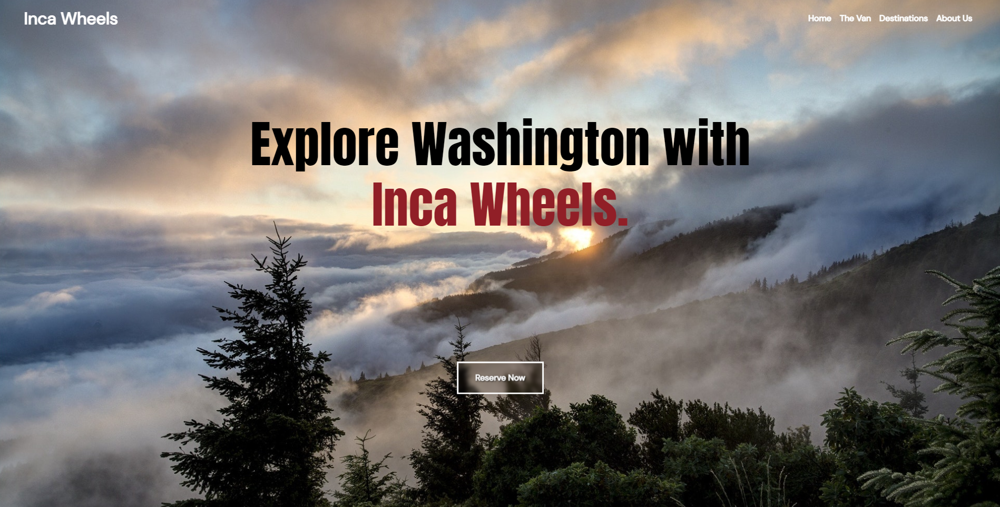
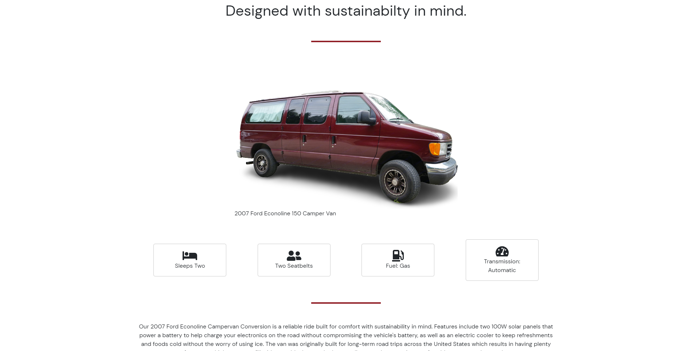
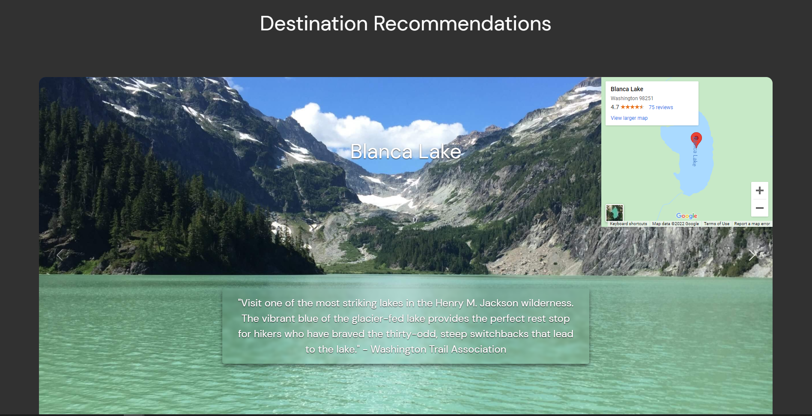

# Inca Wheels

## Table Of Contents

- [Description](#description)
- [Deployed Application](###deployed-Application)
- [User Story](#user-Story)
- [Installation](#installation)
- [Screenshots](#screenshots)
- [Contributors](#contributors)

## Description

Inca Wheels is an indigenous owned outdoor recreational vehicle rental company based in the Pacific Northwest. Started as a way to help raise funds for the nonprofit Ruta Verde that focuses on Sustainable Development projects including the building of Community Forests in North America and creating sustainable food solutions in Peru. The Inca were honorable people that valued their surrounding environments at the core of their belief systems, and we hope to honor this ideology by creating a business that focuses on caring for the planet, not just profits.

## Deployed-Application

https://www.incawheels.com/

## User-Story

    As A outdoor enthusiast,

    I WANT to be able to browse a van rental company services and vehicles that are offered through their website,

    SO THAT I can make a decision on whether or not I will rent their vehicle.

## Installation

- https://github.com/ColinJhEdwards/incawheels
- Cd into the correct folder and enter "npm i" into your terminal to install necessary packages.
- Enter "npm start" into your terminal to start the server.

## Screenshots

## Contributors

This app brought to you by:

- Colin Edwards https://github.com/ColinJhEdwards
